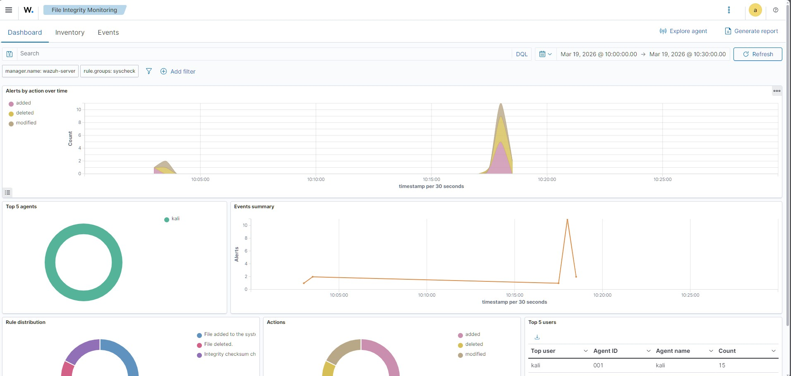
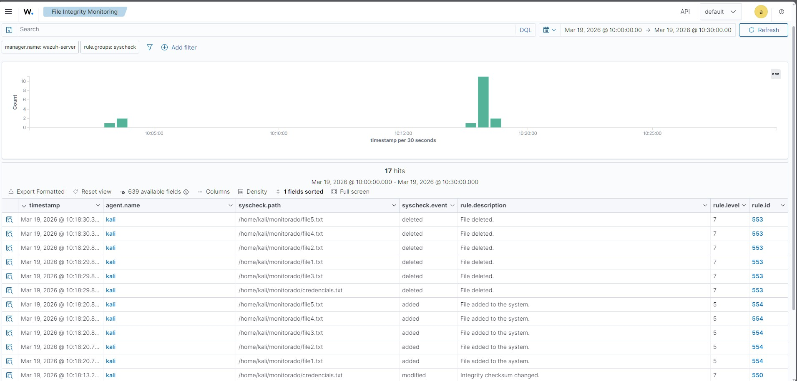
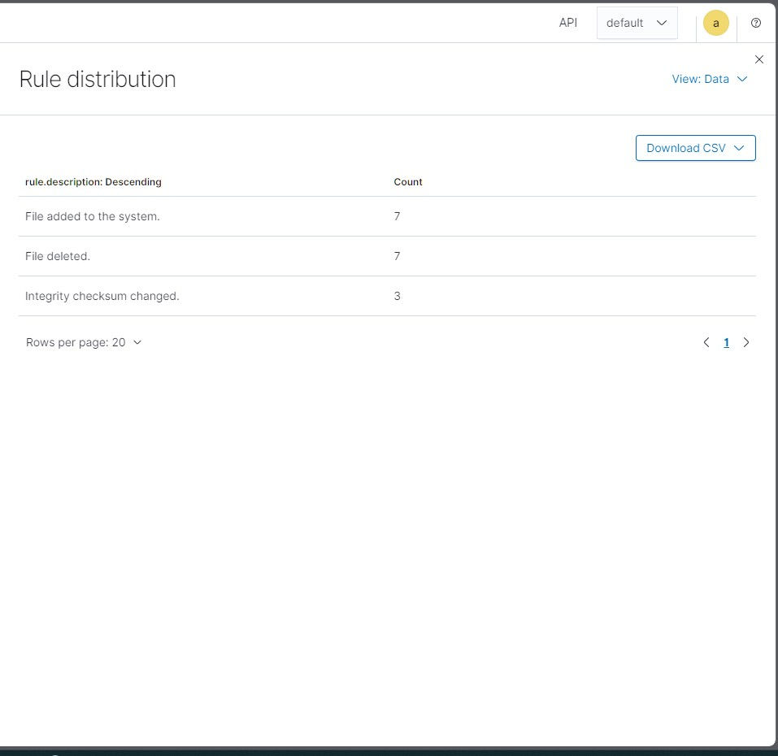

# 🛡️ Lab — File Integrity Monitoring com Wazuh + Kali Linux

## 📌 Descrição

Laboratório prático de **File Integrity Monitoring (FIM)** utilizando Wazuh como plataforma de detecção e Kali Linux como agente monitorado.

O objetivo foi simular alterações em arquivos e acompanhar os alertas gerados em tempo real no dashboard do Wazuh — replicando o que equipes de **Blue Team e SOC** fazem no dia a dia para detectar modificações não autorizadas em sistemas.

---

## 🛠️ Ambiente

| Componente | Detalhe |
|---|---|
| Plataforma de virtualização | VirtualBox |
| Servidor Wazuh | Ubuntu Server 24.04 |
| Agente | Kali Linux |
| Versão do Wazuh | 4.14.4 |
| Comunicação | Host-only Adapter (rede interna) |

---

## 🧪 O que foi simulado

Criação, modificação e deleção de arquivos no diretório monitorado `/home/kali/monitorado`:

```bash
# Arquivo com conteúdo sensível
echo "senha123" > /home/kali/monitorado/credenciais.txt

# Modificação de conteúdo
echo "conteudo alterado" > /home/kali/monitorado/credenciais.txt

# Criação em massa
for i in {1..5}; do echo "arquivo $i" > /home/kali/monitorado/file$i.txt; done

# Alteração de permissões
chmod 777 /home/kali/monitorado/credenciais.txt

# Troca de dono
sudo chown root /home/kali/monitorado/credenciais.txt

# Deleção em massa
rm -rf /home/kali/monitorado/*
```

---

## ⚙️ Configuração do FIM

No agente Kali, foi adicionado o seguinte bloco no arquivo `/var/ossec/etc/ossec.conf`:

```xml
<syscheck>
  <disabled>no</disabled>
  <directories check_all="yes" report_changes="yes" realtime="yes">/home/kali/monitorado</directories>
</syscheck>
```

Os parâmetros utilizados:

- `check_all` — monitora permissões, dono, tamanho e checksum
- `report_changes` — registra o conteúdo alterado
- `realtime` — detecção em tempo real via inotify

---

## 📊 Resultados

### Dashboard — Alertas por ação ao longo do tempo


### Events — Detalhamento de cada evento detectado

> É possível ver cada arquivo afetado, o tipo de evento (added, deleted, modified), o agente responsável e o timestamp exato.

### Rule Distribution — Distribuição das regras disparadas


| Regra | Eventos |
|---|---|
| File added to the system | 7 |
| File deleted | 7 |
| Integrity checksum changed | 3 |

---

## 🎯 Principais Aprendizados

- Configuração de um ambiente Wazuh all-in-one em VM local
- Integração de agente Linux com servidor Wazuh
- Configuração de monitoramento em tempo real com `realtime="yes"`
- Diferença entre os tipos de alerta: added, deleted, modified, permission changed
- Leitura e interpretação de eventos no dashboard de FIM

---

## 🔗 Referências

- [Documentação oficial do Wazuh — File Integrity Monitoring](https://documentation.wazuh.com/current/user-manual/capabilities/file-integrity/index.html)
- [Wazuh Install Script](https://documentation.wazuh.com/current/quickstart.html)
